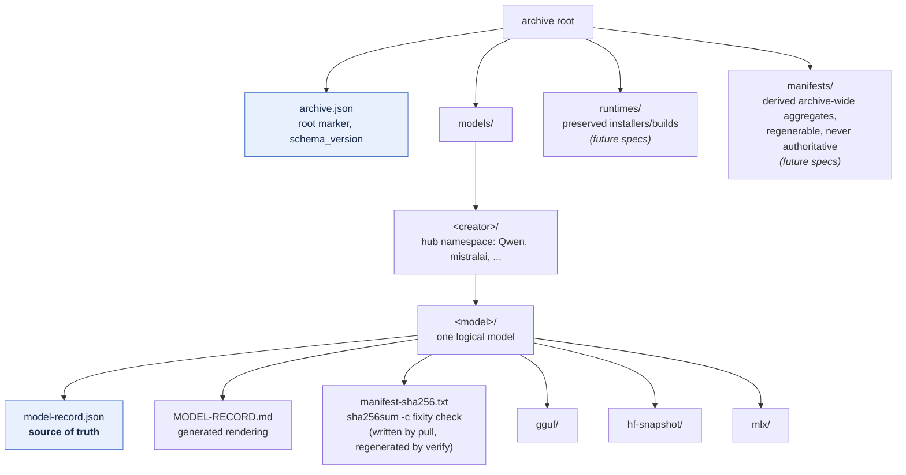
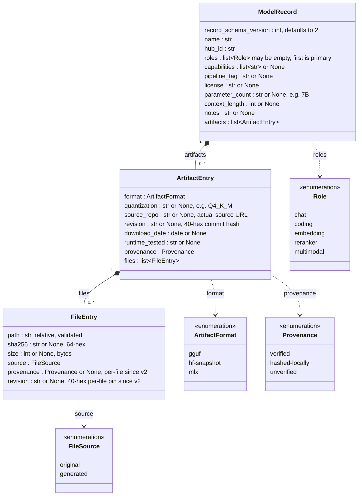
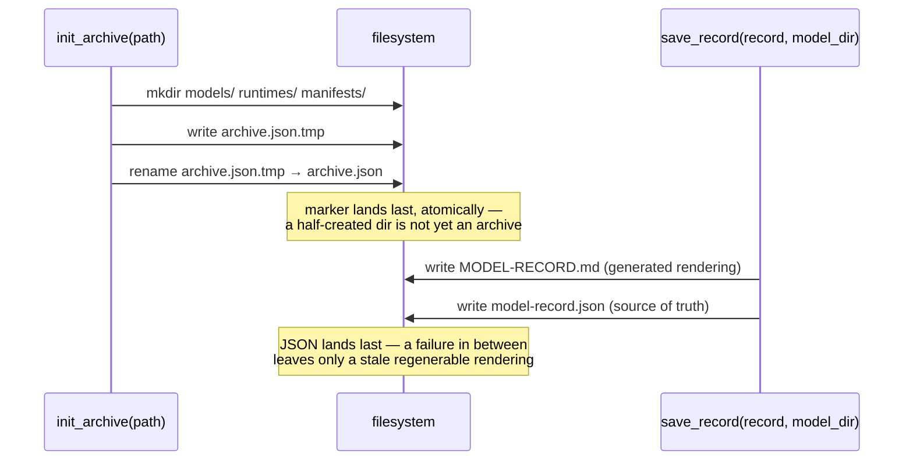
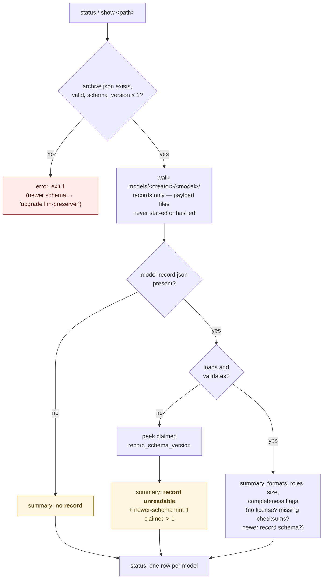
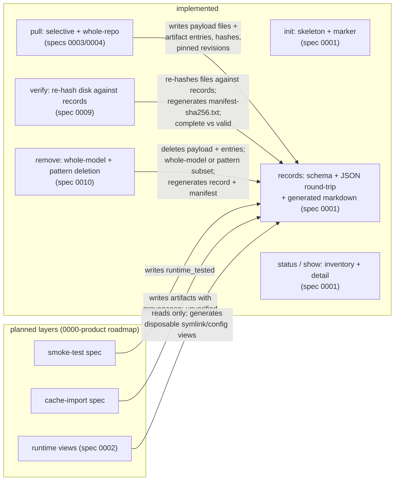

# Data structures

Visual reference for the on-disk and in-memory structures the tool is
built on. This is the foundation layer (spec 0001, layout decided by
ADR 0001 — `docs/adr/0001-model-storage.md`); every later feature —
pull, verify, and remove (shipped), smoke test and runtime views
(planned) — reads, writes, or deletes these same structures. Diagrams
are Mermaid — GitHub and VS Code's markdown preview render them
natively.

Source of truth for the schemas is the code
(`src/llm_preserver/records/schema.py`, `src/llm_preserver/archive.py`)
and ADR 0001; this document is a rendering of them. If they disagree,
the code and ADR win — update this file.

## The big picture

One archive root, marked by `archive.json`. One directory per logical
model under `models/<creator>/<model>/`, holding *every* archived
format of that model plus its own metadata. Metadata travels with the
model: a partially copied archive (one model directory rsynced
elsewhere) carries its own record.



The same tree as it lands on disk (format subdirectories exist only for
formats archived):

```text
<archive-root>/
  archive.json                      # root marker: {"tool": "llm-preserver", "schema_version": 1}
  models/
    <creator>/                      # original model's hub namespace
      <model>/                      # one dir per logical model
        model-record.json           # source of truth for ALL formats below
        MODEL-RECORD.md             # generated from the JSON; never parsed back
        manifest-sha256.txt         # coreutils-checkable fixity (pull writes, verify regenerates)
        gguf/                       # only the formats actually archived
        hf-snapshot/
        mlx/
  runtimes/                         # (planned) preserved runtime installers/builds
  manifests/                        # (planned) regenerable archive-wide aggregates
```

Two identity rules worth internalizing (ADR 0001):

- **The directory answers "what model is this"; the record answers
  "where did each file come from."** `<creator>/<model>` is always the
  *original* model's hub id, even when an artifact was pulled from a
  third-party repo (e.g. a `bartowski/...-GGUF` quant files under the
  original creator; the quant repo's URL lives in that artifact's
  `source_repo`).
- **Role is metadata, not layout.** Embedding and reranker models are
  ordinary model directories with `roles: ["embedding"]` etc. in the
  record — there are no role-based top-level directories.

## The record schema (`model-record.json`)

Three nested Pydantic models, one JSON file. `ModelRecord` describes
the logical model, `ArtifactEntry` one archived form of it (a format at
a quantization), `FileEntry` one file of that artifact.



Semantics that don't fit in a box:

| Field | Why it's shaped this way |
| --- | --- |
| `roles` vs `capabilities` | `roles` is curator judgment ("why is this on the shelf") — a strict enum, first entry drives `status` grouping. It may be empty (schema v2): roles are judgment the tool never fabricates, so a freshly pulled model can carry none and groups under a "(no role)" bucket. `capabilities` is machine facts recorded from source metadata (`tools`, `vision`, ...) — free strings, because the vocabulary belongs to hubs/runtimes and will grow. |
| `revision` | Full 40-hex commit hash only; a branch name is a moving pointer, not provenance, and fails validation. The artifact-level field tracks the most recent pull; each `FileEntry` also carries its own `revision` pin (schema v2), so a merged artifact never implies older files were resolved at a newer commit. |
| `provenance` | `verified` = local SHA256 matched a hub-declared hash; `hashed-locally` (schema v2) = the hub published no hash to check against, so the file was hashed on download but not cross-checked; `unverified` = cache import that can't be checked against a source. Recorded per file (v2); an artifact is `verified` only when every file is. |
| `FileEntry.source` | Internet Archive's original-vs-generated split: `original` files (weights, tokenizer, license) are sacred and never regenerable; `generated` files (`MODEL-RECORD.md`, future manifests) can be rebuilt from originals + record. Backup and recovery logic treat the classes differently. |
| `FileEntry.path` | Upstream filename preserved verbatim (GGUF names encode quant type and shard position). Validated: relative, POSIX, no `..`, no backslashes or control characters — filenames are upstream-supplied and therefore untrusted. The three tool-owned root filenames (`model-record.json`, `MODEL-RECORD.md`, `manifest-sha256.txt`) are also reserved (spec 0010): a record may not name one as a payload path. |
| Nullable fields | "Unknown at this point in time", serialized as explicit `null` — never omitted — so a reader can tell "unknown" from "not part of this schema version". Schema evolution is add-a-field, never rename. |

### Example record

```json
{
  "record_schema_version": 2,
  "name": "Qwen2.5 Coder 32B Instruct",
  "hub_id": "Qwen/Qwen2.5-Coder-32B-Instruct",
  "roles": ["coding", "chat"],
  "capabilities": ["tools"],
  "pipeline_tag": "text-generation",
  "license": "Apache-2.0",
  "parameter_count": "32B",
  "context_length": 131072,
  "notes": null,
  "artifacts": [
    {
      "format": "gguf",
      "quantization": "Q4_K_M",
      "source_repo": "https://huggingface.co/bartowski/Qwen2.5-Coder-32B-Instruct-GGUF",
      "revision": "0123456789abcdef0123456789abcdef01234567",
      "download_date": "2026-07-09",
      "runtime_tested": null,
      "provenance": "verified",
      "files": [
        {
          "path": "gguf/Qwen2.5-Coder-32B-Instruct-Q4_K_M.gguf",
          "sha256": "aaaaaaaaaaaaaaaaaaaaaaaaaaaaaaaaaaaaaaaaaaaaaaaaaaaaaaaaaaaaaaaa",
          "size": 19851335840,
          "source": "original",
          "provenance": "verified",
          "revision": "0123456789abcdef0123456789abcdef01234567"
        }
      ]
    }
  ]
}
```

Note how the third-party quant repo appears in `source_repo` while the
directory (and `hub_id`) belong to the original creator.

## Two version numbers, two behaviors

Both structures are versioned, independently, and the tool reacts
differently to each:

| Version | Lives in | Constant | On a *newer* value |
| --- | --- | --- | --- |
| Archive schema | `archive.json` → `schema_version` | `archive.SCHEMA_VERSION = 1` | **Refuse.** Every command — including read-only `status`/`show` — errors and tells the user to upgrade. |
| Record schema | `model-record.json` → `record_schema_version` | `records.RECORD_SCHEMA_VERSION = 2` | **Flag, don't refuse.** `status` shows it in the completeness column; `show` warns on stderr but still renders. Read-only inspection stays useful. |

Schema v2 (spec 0003) widened v1: per-file `provenance` and
`revision`, the `hashed-locally` provenance state, and optional-empty
`roles`. v1 records still load — every v2 change is a widening (a new
optional field, a new enum value, a relaxed constraint), never a
rename.

The record carries its own version so a lone model directory rsynced
away from the archive stays self-describing without the root marker.

Two more schema-evolution guards in the record layer:

- **Unknown fields survive round-trips** (`extra="allow"` on every
  record model): a record written by a newer tool keeps its extra
  fields through an older tool's load → modify → save cycle instead of
  being silently stripped.
- **Strict vocabularies degrade visibly**: an unknown `role` or
  `format` value fails validation and the record shows as
  `record unreadable` (with a newer-schema hint when the record claims
  one); the on-disk JSON is never touched.

## Write paths: ordering is the crash-safety story

There are no transactional writes (ADR 0001 accepts this) — the
convention is *write the source of truth last*, so a crash in the
middle leaves stale-but-regenerable debris, never committed truth
missing its supporting files.



The same convention extends to pull (specs 0003/0004): payload files
first, record last, so the record only ever describes files that exist.
A pull that is interrupted before the record is written therefore leaves
partial bytes in `.staging/<creator>/<model>/` and no record at all —
regenerable debris that the record-anchored audit cannot see, since it
has nothing recorded to check. `verify --staging` surfaces exactly that
leftover with a hash-free `.staging/` scan (spec 0012); it is cleared by
resuming the pull or by `remove`.

**Removal inverts the convention** (spec 0010), because deletion is the
mirror of writing. `remove` of a whole model deletes the record
*first*, then the payload: a crash then leaves an unrecorded directory
`status`/`verify` already surface as a degraded state (and a re-run
finishes), never a record naming files that are gone — which would read
as corruption. Pattern-scoped `remove` writes the *updated* record
first (survivors only, manifest regenerated), then unlinks the
de-listed files: a crash leaves informational `unrecorded` strays a
re-run of the same command sweeps up. Either way the source of truth is
touched first on the way out, so the transient state is always
"regenerable debris," never "truth missing its support."

`init` is idempotent and defensive: re-running on an existing archive
changes nothing; a non-empty directory that is *not* an archive is
refused untouched.

## Read paths: gate, walk, degrade

Every command validates the archive marker before touching contents,
and the inventory walk degrades per-model instead of failing the whole
archive.



Defensive reads, because an archive may not be one the user authored
(a copied NAS share): metadata files are size-capped (1 MB), symlinked
markers/records/model-directories are refused, and `show`'s
`<creator>/<model>` argument is validated against a strict pattern
before any path is constructed.

## How the layers stack

What exists today versus what each planned feature adds. Every future
layer writes into the structures above — none introduces a new
top-level shape (that would take a new ADR).



Related vocabulary verify uses (adopted from BagIt, ADR 0001; spec
0009): **complete** = every file the record lists is present;
**valid** = complete *and* every SHA256 matches. The record enumerates
*expected* files, which is what makes a partially rsynced or
crash-interrupted model directory detectable offline.

## In-memory structures (not persisted)

`ModelSummary` (`archive.py`) is the per-model row behind `status` — a
plain dataclass built either from a validated record or from the
degraded states above. It is derived data, computed on every walk, and
never written to disk. Sizes come from record entries, never from
stat-ing the filesystem.
