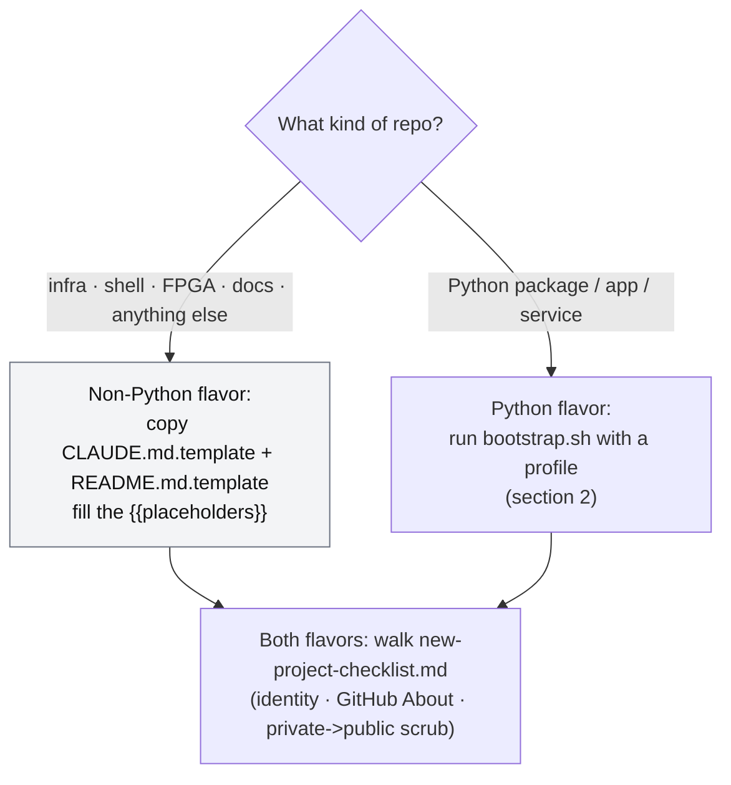
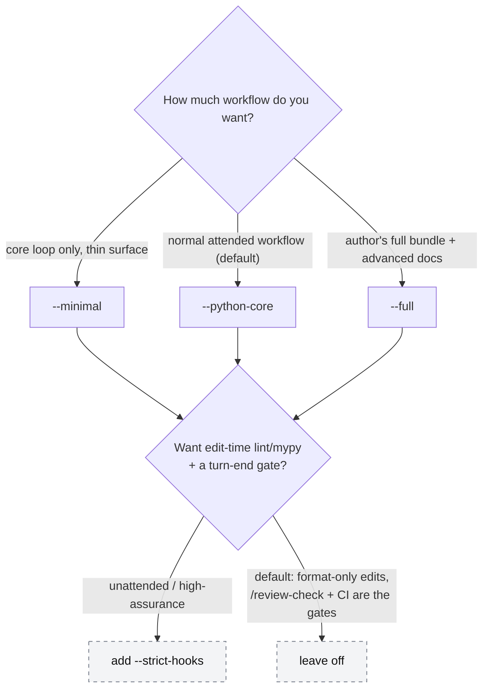
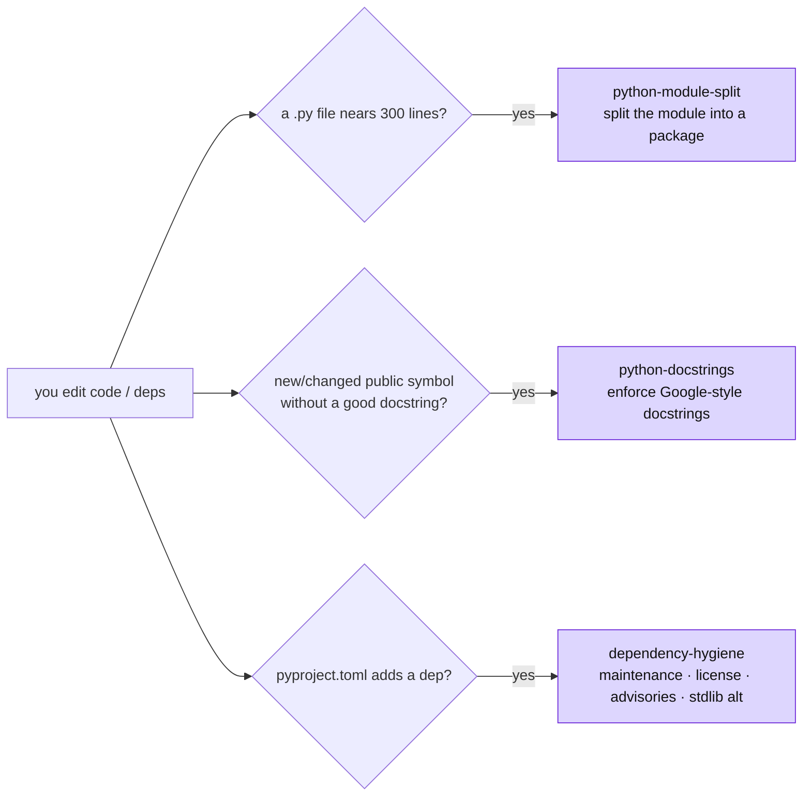

# Project types, profiles, and when to use each piece

> **Purpose.** The orientation map for someone new to this scaffolding.
> Answers three questions: *which project type do I pick*, *what did that
> give me*, and *when do I run each agent / skill / command*. For the
> **shape** of the loop see [`workflow-diagram.md`](workflow-diagram.md);
> for the **steps** in order see [`../WORKFLOW.md`](../WORKFLOW.md); for the
> **rules** the agent follows every turn see [`../CLAUDE.md`](../CLAUDE.md).

The one idea that ties this together: **every project type runs the same
five-phase loop** — `Spec -> Plan -> Test-first -> Implement -> Verify`.
The type does not change the loop. It changes *how much scaffolding* is
installed around it. Pick the smallest type that fits; grow later with
`bootstrap.sh --update <profile>`.

---

## 1. Pick a flavor

The **non-Python flavor** is just two templates and the checklist — no
subagents, hooks, or slash commands. It gives an AI agent a clean context
file and public-repo hygiene rules; the rest of this document is about the
**Python flavor**, where the full workflow surface lives.

---

## 2. Pick a Python profile

`bootstrap.sh` installs one of three profiles. The default is
`--python-core`. Two options compose on top of any profile: `--strict-hooks`
(enforce lint/type-check on every edit and block turn-end on a red gate)
and `--advanced-docs` (add the deeper doctrine docs without going full).

| Profile | Who it is for | One-line summary |
| --- | --- | --- |
| `--minimal` | A small repo that wants the core loop without the full Claude surface | Spec/plan/test/review commands, core agents, safety hooks, rules, specs convention, CI |
| `--python-core` (default) | The normal attended Python agentic workflow | Minimal + skills, ADRs, the sharpening commands, status dashboard, workflow diagram, Dependabot |
| `--full` | The author's complete workflow bundle | Python-core + advanced docs (parallel agents, plugin path, serena, evals) + optional-reviewer command stubs |

Grow or shrink later: `bootstrap.sh --update --full` promotes a project;
project-owned files (`CLAUDE.md`, `pyproject.toml`, `README.md`,
`.gitignore`) are never overwritten.

---

## 3. What each profile installs

Read top-down: everything in a tier includes the tiers above it.

### Core — every profile, including `--minimal`

- **Commands:** `/spec`, `/plan`, `/test-first`, `/review-check`, `/review`
- **Agents:** `planner`, `test-first`, `reviewer`
- **Hooks:** `branch-check` (warn on `main`), `block-destructive`
  (deny unrecoverable Bash), `specs-status` (refresh the spec dashboard),
  `strip-ai-attribution` (commit-msg backstop); default settings run
  `ruff format` on edit
- **Rules:** git-workflow, commit-style, public-repo-hygiene, python-code,
  agent-legible-code
- **Convention + CI:** `docs/specs/README.md`, `.github/workflows/ci.yml`
  (ruff · mypy · pytest · pip-audit), PR template, issue forms,
  `.pre-commit-config.yaml`

### Added by `--python-core` (the default)

- **Commands:** `/product-spec`, `/scope-check`, `/clarify`, `/adr`,
  `/analyze`, `/specs-status`, `/review-adversarial`
- **Agents:** `reviewer-adversarial`
- **Skills (auto-fire, section 5):** `python-module-split`,
  `python-docstrings`, `dependency-hygiene`
- **Docs:** `docs/adr/README.md`, `docs/workflow-diagram.md`,
  `docs/agent-handoff.md`
- **Automation:** `.github/dependabot.yml`

### Added by `--full` (or `--advanced-docs` for the docs only)

- **Docs:** `docs/parallel-agents.md`, `docs/plugin-packaging.md`,
  `docs/serena-setup.md`, `docs/evals.md`, `docs/llm-product.md`
- **Commands (`--full` only):** `/security`, `/performance`, `/eval`
  (stubs — each requires its opt-in agent, below)
- **Workflow (`--full` only):** `.github/workflows/claude-review.yml.example`

### Added by `--strict-hooks` (any profile)

- **Hook:** `gate-on-stop` (blocks turn-end while `src/` is dirty and
  ruff/mypy/pytest are red) and a settings rewrite so edits run
  `ruff format` + `ruff check` + `mypy`.

### Opt-in agents — never auto-copied, manual per project (section 6)

- `security-reviewer`, `performance-reviewer`, `evaluator` — copy from
  `.claude/agents/optional/` only when the project's surface warrants it.

---

## 4. When to run each agent and command

The loop's five phases are fixed; these are the tools that drive them plus
the optional sharpening passes. "Profile" is the thinnest profile that
ships the command.

| Run this | It does | Reach for it when | Profile |
| --- | --- | --- | --- |
| `/spec` | Writes `docs/specs/NNNN-*.md` — drafts goal/success/non-goals from the current discussion, or a skeleton to fill; stops for your review | Any non-trivial feature — the source of truth | minimal |
| `/plan` (`planner`) | Read-only file-by-file plan | The task touches > 3 files | minimal |
| `/test-first` (`test-first`) | Writes failing pytest tests from the spec | Before writing any implementation code | minimal |
| `/review-check` | Local gate: ruff · mypy · pytest | Before `/review` and before commit | minimal |
| `/review` (`reviewer`) | Fresh-context diff review vs the spec | After the gate is green, before commit | minimal |
| `/product-spec` | Interview -> `docs/specs/0000-product.md` | Backlog outgrows your head, or before a multi-spec autonomous run | python-core |
| `/scope-check` | Five forcing questions | The goal is fuzzy, before `/spec` | python-core |
| `/clarify` | Interrogates a draft spec, writes answers back | The spec has real unknowns, after your first edit | python-core |
| `/adr` | Records a cross-cutting technical decision | Large work with a choice costly to reverse | python-core |
| `/analyze` | Read-only spec ↔ tests ↔ diff consistency check | Want proof tests cover the spec before implementing | python-core |
| `/review-adversarial` (`reviewer-adversarial`) | Argues *against* the diff | Meaningful PRs — pair with `/review` for A/B | python-core |
| `/specs-status` | Refreshes + prints the spec dashboard | Any time you want the backlog at a glance | python-core |
| `/security` (`security-reviewer`) | App-sec-only review | The diff touches a trust boundary (section 6) | full + opt-in agent |
| `/performance` (`performance-reviewer`) | Perf-only review | The diff touches a hot path (section 6) | full + opt-in agent |
| `/eval` (`evaluator`) | Authors/runs an LLM output-quality eval | The product ships an LLM/AI surface (section 6) | full + opt-in agent |

Two hard rules survive every profile: **CI is the gate you cannot skip**,
and **you write the commit message** — the agent never commits for you.

The planning artifacts nest broad to narrow — **product spec (PRD) -> ADR
-> spec** — and each has its own authoring flow in
[`../WORKFLOW.md`](../WORKFLOW.md) → "The planning artifacts, broad to
narrow":

- **Product spec (PRD)** — `/product-spec` interviews you; use it when the
  backlog outgrows your head. Standing context the rest link up to.
- **ADR** — write it yourself or discuss then have `/adr` draft it; use it
  for a cross-cutting technical decision costly to reverse (Large work).
- **Spec** — write it yourself, discuss then have `/spec` draft it, or let
  `/scope-check` + `/clarify` interview you. The everyday artifact.

A hierarchy, not a pipeline: most features are just product context ->
spec, with no ADR.

---

## 5. When each skill auto-fires

Skills are not commands — you never invoke them. They load on their own
when the diff trips a trigger, injecting a focused check at exactly the
moment it is relevant. They ship with `--python-core` and `--full`.

| Skill | Fires when | What it enforces |
| --- | --- | --- |
| `python-module-split` | A `.py` file approaches ~300 lines | Split into a package, preserve the public API |
| `python-docstrings` | A new/changed public symbol lacks a compliant docstring | Google-style docstrings on public functions/classes/modules |
| `dependency-hygiene` | `pyproject.toml` gains a dependency | Screen maintenance, license, advisories, and stdlib alternatives before it lands |

---

## 6. Special project surfaces (opt-in)

These are cross-cutting properties of a project, not profiles. Decide them
at day zero (see the day-zero diagram in
[`workflow-diagram.md`](workflow-diagram.md)) and enable only what applies.
The reviewer agents live in `.claude/agents/optional/`; copy the one you
need into `.claude/agents/` and add a one-line mention in `CLAUDE.md`.

| Your project has… | Enable | When to skip | Reference |
| --- | --- | --- | --- |
| A network surface, auth, untrusted input, secrets, or external deserialization | `security-reviewer` + `/security` | Pure-local tooling with no trust boundary | agent header |
| A hot path, DB queries on user-sized data, async, or a latency SLO | `performance-reviewer` + `/performance` | Nothing runs under load | agent header |
| A product LLM/AI surface (summarizer, RAG, chatbot, agent trajectory, NL classifier) | `evaluator` + `/eval`; build to the [`llm-product.md`](llm-product.md) conventions | Deterministic product — tests suffice | [`evals.md`](evals.md) · [`llm-product.md`](llm-product.md) |
| A large, long-lived repo where the agent re-maps structure every session | `serena` MCP | Fresh or small repo — grep is enough | [`serena-setup.md`](serena-setup.md) |
| Two+ features independent at the file level, or a long unattended run | Worktrees / completion ladder | You are at the keyboard on one feature | [`parallel-agents.md`](parallel-agents.md) |

`evals.md`, `llm-product.md`, `serena-setup.md`, and `parallel-agents.md`
install with `--full` or `--advanced-docs`. The optional agents themselves are always
available in the scaffold's `.claude/agents/optional/`, whatever profile
you installed.

---

## Where to go next

- [`workflow-diagram.md`](workflow-diagram.md) — the loop as diagrams:
  day zero, the per-feature loop, the automation layer, "scale to the task."
- [`../WORKFLOW.md`](../WORKFLOW.md) — the steps in order, one line of why each.
- [`../CLAUDE.md`](../CLAUDE.md) — the rules the agent follows every turn.
- [`specs/README.md`](specs/README.md) — spec numbering, local-only mode,
  the product spec, section shapes.
