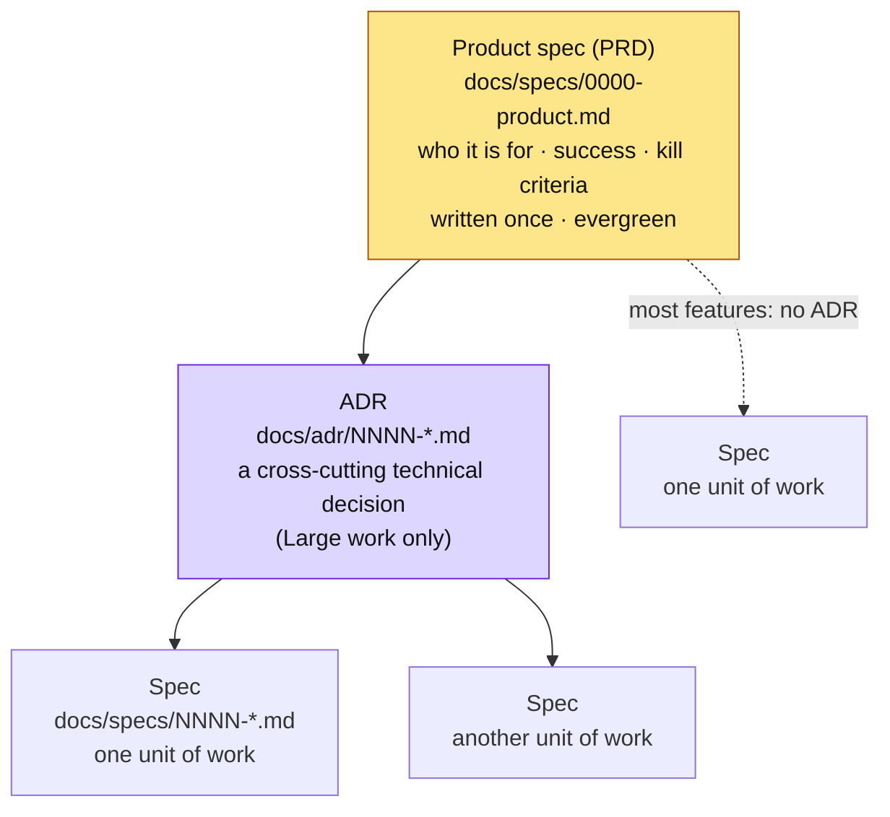
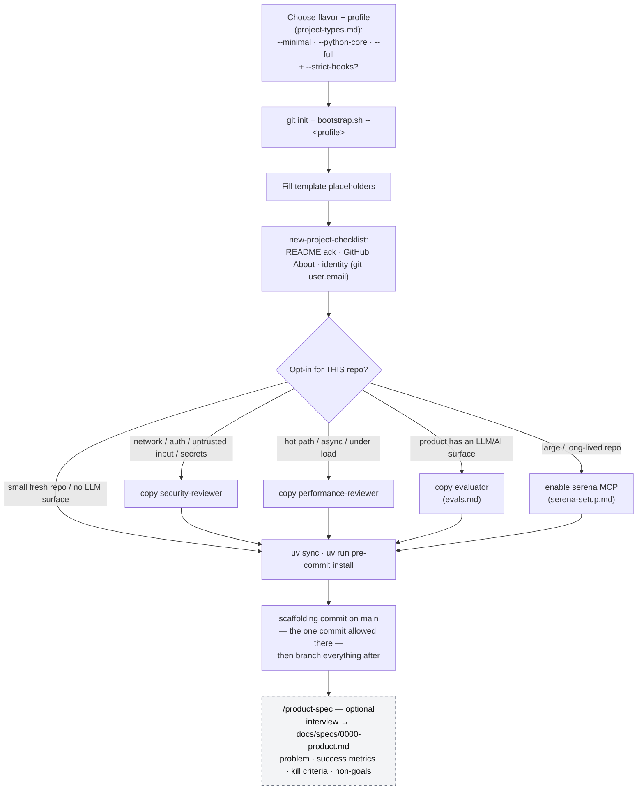
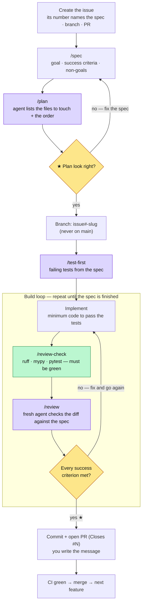
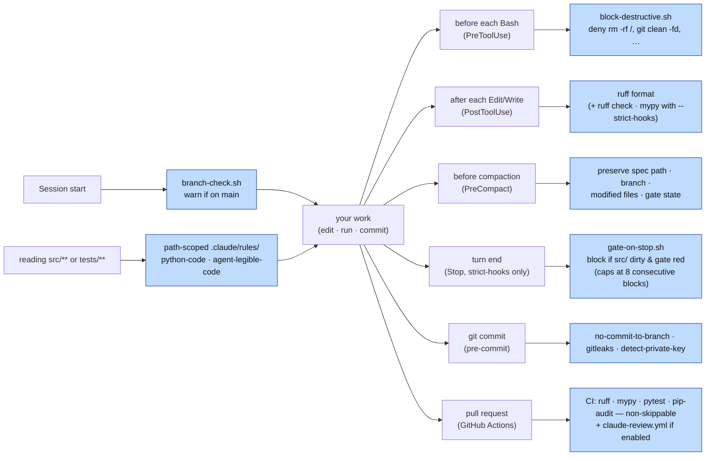
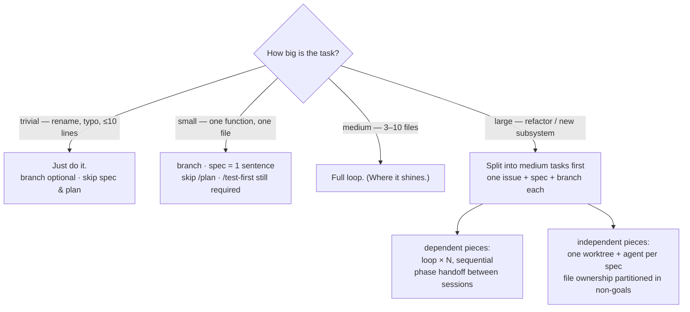
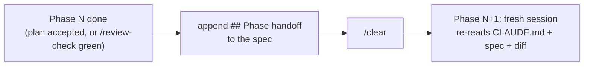

# Agentic workflow — visual map

> **Purpose.** The visual / systems companion to the methodology.
> `../CLAUDE.md` is the *rules* the agent follows every turn;
> [`../WORKFLOW.md`](../WORKFLOW.md) is the prose *walkthrough* — what to
> run at each step, in order, and why. This file is the *map*: how the
> spec, branch, slash commands, subagents, hooks, and CI fit together, in
> diagrams. Read WORKFLOW.md for the *steps*; read this to see the
> *shape*.
>
> Diagrams are [Mermaid](https://mermaid.js.org/) — they render natively on
> GitHub and in Obsidian (VS Code needs the "Markdown Preview Mermaid
> Support" extension), and degrade to readable source everywhere else. This
> doc is generic scaffolding; nothing here is project-specific.
>
> New here? Start with [`project-types.md`](project-types.md) to choose a
> flavor and profile and see which agents, skills, and commands you get.
> This file is the loop those pieces run inside.

---

## Three actors

The loop has three actors, and most of the design is about keeping them in
their lanes:

- **You** — drive the loop, own the two checkpoints, write the spec and
  the commit message. The agent never commits for you.
- **The agent** (main session) — the *orchestrator*: holds the spec, runs
  each phase, delegates focused work to subagents to keep its own context
  clean.
- **Automation** — hooks and CI that fire on their own (on edit, on
  turn-end, on commit, on PR) so discipline doesn't depend on memory.

The diagrams below colour these where it helps: **★ checkpoints** are
yours, **gates** are automated, **subagents** run in fresh context.

---

## The planning artifacts (how the three docs nest)

Three documents plan the work, broadest to narrowest. This is a
*hierarchy*, not a per-feature pipeline: the product spec is standing
context, ADRs appear only on Large cross-cutting work, and most features
go straight from product context to a spec (the dashed path).

Each narrower artifact links *up* to the broader one: a feature spec links
to the product spec instead of restating product rationale, and to any ADR
its approach depends on. Authoring flows for all three — in this same
broad-to-narrow order — are in [`../WORKFLOW.md`](../WORKFLOW.md) → "The
planning artifacts, broad to narrow."

---

## Day zero (once per project)

The profile decides how much scaffolding lands — see
[`project-types.md`](project-types.md) for the choice and the full list of
what each profile installs. The identity check is load-bearing:
`git config user.email` is baked into the first commit forever and leaks
once the repo flips public. Opt-ins are decided *now*, not retroactively —
see [`../WORKFLOW.md`](../WORKFLOW.md) "Day zero."

`/product-spec` is the product-level layer — the job a PRD does on a
team. It interviews you (seven questions, one at a time) and writes
`docs/specs/0000-product.md` from the answers; feature specs link up to
it instead of restating product rationale. Optional on day one — a
README purpose paragraph covers a small project — but write it before
the backlog outgrows your head or before any multi-spec autonomous run.
Canonical description in [`specs/README.md`](specs/README.md) → "The
product spec."

---

## The per-feature loop

Set up once, then loop. The top is linear — issue, spec, plan, branch,
first tests. Then **implement → check → review repeats until every
success criterion in the spec passes.** Then you ship.

**You stop at two ★ checkpoints; the agent drives the loop between
them.** Checkpoint one: approve the plan (a wrong plan is a one-paragraph
spec fix — much cheaper than catching it later). Checkpoint two: decide
the spec is finished before you commit.

**The issue comes first** — and an issue is a work item (like a Jira or
Linear ticket, not just a bug report). Its number is the shared id for
the spec, the branch, and the PR's `Closes #N`. The number is identity,
not order; see [`specs/README.md`](specs/README.md) → "Numbering".

**Optional sharpening passes** slot in where each helps and are left off
the diagram to keep it clean: `/scope-check` (fuzzy goal) and `/clarify`
(open questions) before building, `/analyze` (tests cover the spec?)
after `/test-first`, `/security` and `/performance` during review — and,
on a project whose product contains an LLM/AI surface, `/eval` during
review to gate output quality a test can't assert (most projects have no
LLM surface and skip it). See [`../WORKFLOW.md`](../WORKFLOW.md).

---

## The automation layer (fires on its own)

The linear loop above hides the guardrails firing around it. These need no
slash command — they trigger on lifecycle events so "I forgot to run the
gate" stops being a failure mode.

Behaviour, edge cases, and how to bypass each (e.g. the Stop hook when
`--strict-hooks` is enabled, `--no-verify` for the day-zero commit) live in
`../CLAUDE.md` → **Hooks and guardrails**. The line `block-destructive`
draws is *unrecoverable* — things the reflog or a re-clone can't bring
back; merely risky-but-recoverable commands stay off it. OS-level
sandboxing (`/sandbox`) and permission modes sit above all of these for
unattended runs.

---

## Scale the loop to the task

Heavyweight process on trivial work is its own failure mode. Pick the path
by size:

A change that would touch **> 5 files** is a stop-and-ask, not a
proceed-anyway — see `../CLAUDE.md` "Your role: orchestrator." A complex
program is not a bigger loop — it is the same medium-sized loop run *N*
times over a split backlog, sequentially when the pieces depend on each
other, in parallel worktrees when they don't
([`parallel-agents.md`](parallel-agents.md)).

---

## When to use what

The loop is fixed; everything else is opt-in. One row per decision —
the *Skip when* column is as load-bearing as the *Reach for* column.

| Situation | Reach for | Skip when |
| --- | --- | --- |
| Backlog outgrows your head, or a multi-spec autonomous run is coming | `/product-spec` — interview → `docs/specs/0000-product.md` | Small project where the README purpose paragraph still covers it |
| Goal itself is fuzzy ("we should do something about X") | `/scope-check` before `/spec` | The goal is already one concrete sentence |
| A spec can't start until other specs ship | `**Depends on:** NNNN` in its header; `/specs-status` shows `(blocked)` | No cross-spec ordering — most specs |
| Spec draft has real unknowns (data shapes, failure behavior) | `/clarify` after editing the spec | The spec is tight; don't invent questions |
| Want proof tests cover the spec before implementing | `/analyze` after `/test-first` | Trivial/small tasks; one-criterion specs |
| Network surface, auth, untrusted input, secrets | `security-reviewer` (opt-in, decide at day zero) | Pure-local tooling with no trust boundary |
| Hot path, DB on user-sized data, async, latency SLO | `performance-reviewer` (opt-in) | Nothing runs under load |
| Product contains an LLM/AI surface whose output is judged for quality | `evaluator` + `/eval` (opt-in; [`evals.md`](evals.md)); build it per [`llm-product.md`](llm-product.md) | Deterministic product — tests suffice, no LLM surface |
| Agent burns turns re-mapping a large, long-lived repo | `serena` MCP ([`serena-setup.md`](serena-setup.md)) | Fresh or small repo — grep is enough |
| Two+ features independent at the file level | Worktrees, one agent each ([`parallel-agents.md`](parallel-agents.md)) | Tasks share files, or work is exploratory |
| Long run with nobody watching | Completion ladder rungs 2–4 + `/sandbox` | You're at the keyboard — checkpoints suffice |
| Feature spans sessions | `## Phase handoff` + `/clear` | Single-session features — pure overhead |
| Recurring agent mistake | A line in `CLAUDE.md` / `.claude/rules/`, same change | One-off slip — correcting in-session is enough |
| Want PR review without a human reviewer handy | `claude-review.yml.example` (rename; bills an API key) | `/review` before the PR already covers it |
| Many projects consuming this scaffolding | Plugin packaging ([`plugin-packaging.md`](plugin-packaging.md)) | `bootstrap.sh --update` still takes seconds |

---

## Multi-day: phase handoff

Single-session features run the loop end-to-end. When a feature spans
sessions, running it all in one context degrades review quality (the
U-curve). Reset at a phase boundary instead:

The two boundaries worth a `/clear`: after `/plan` is accepted (before
`/test-first`), and after `/review-check` passes (before `/review`).
Section shapes are in [`specs/README.md`](specs/README.md).

---

## Go deeper

- [`project-types.md`](project-types.md) — choose a flavor and profile,
  and the matrix of which agents, skills, and commands each one installs.
- [`../WORKFLOW.md`](../WORKFLOW.md) — the step-by-step walkthrough:
  day-zero setup and the per-feature loop, one line of why per step.
- `../CLAUDE.md` + `.claude/rules/` — the rules the agent reads every
  turn (delegation tables, git workflow, hooks, public-repo hygiene).
- [`specs/README.md`](specs/README.md) — spec numbering (identity, not
  order), status vocabulary, the `0000-product.md` product spec,
  `## External references`, `## Phase handoff`, `## Implementation Notes`.
- [`parallel-agents.md`](parallel-agents.md) — degrees of autonomy, the
  completion ladder, worktree parallelism, agent teams, unattended runs.
- [`agent-handoff.md`](agent-handoff.md) — the operational runbook:
  current state, known risks, accepted commands, rollback playbook.
- [`plugin-packaging.md`](plugin-packaging.md) — the (not-yet-adopted)
  plugin/marketplace distribution path.
- [`serena-setup.md`](serena-setup.md) — the optional symbol-navigation MCP.
- [`evals.md`](evals.md) — the two senses of "eval": the output/trajectory
  review you already do (`/review`, `/analyze`, completion ladder), plus the
  opt-in product-eval layer for an LLM/AI-surface product.
- [`llm-product.md`](llm-product.md) — construction-side conventions for
  that surface: the call seam, testing without live calls, prompt
  versioning, model pinning.
